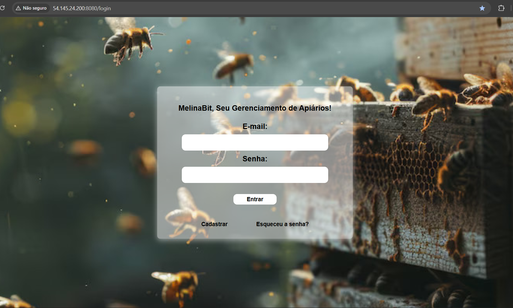
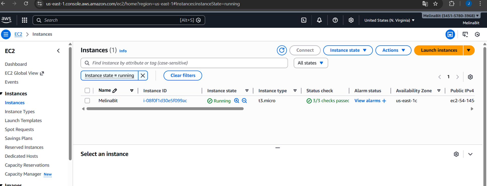

# 🐝 MelinaBit – ERP para Gestão de Apiários

---

## 📖 Descrição

O **MelinaBit** é um ERP desenvolvido em **Java 21 com Spring Boot**, voltado para a gestão técnica e produtiva de apiários.

O sistema permite controle de:

- Manejo técnico das colmeias  
- Estoque e movimentações  
- Vendas  
- Clientes  
- Fornecedores  

Com foco em **rastreabilidade**, organização de dados e apoio à tomada de decisão no agronegócio.

---

## 🏗 Arquitetura e Tecnologias

- Java 21  
- Spring Boot  
- Spring Security  
- PostgreSQL  
- Docker  
- AWS (EC2 + RDS)  
- Padrão MVC (Model-View-Controller)  

Arquitetura em camadas:

Cliente → Controller → Service → Repository → PostgreSQL

---

## ☁ Deploy em Nuvem

A aplicação foi:

- Containerizada com **Docker**
- Implantada na **AWS**
- Executada em instância **EC2**
- Conectada a banco **PostgreSQL no RDS**

Simulando um ambiente real de produção.

---

## 🖥️ Diagrama de Arquitetura


---

## 🖥️ Evidências de Deploy (AWS)

### 🔐 Tela de Login


### ☁ Instância AWS EC2


---

## 🚀 Funcionalidades

- Cadastro de apiários  
- Registro de manejo  
- Controle de estoque  
- Gestão de clientes e fornecedores  
- Dashboard administrativo  
- Controle de acesso por perfil  

---

## 🐳 Execução Local com Docker

```bash
docker-compose up --build
