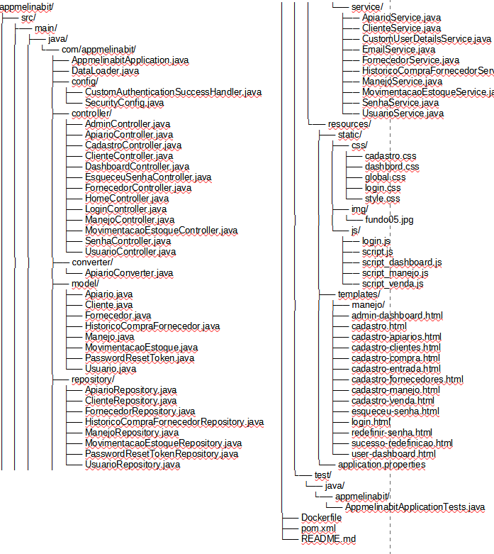

📌 Título
🐝 MelinaBit – ERP para Gestão de Apiários

📖 Descrição

O MelinaBit é um ERP desenvolvido em Java 21 com Spring Boot, voltado para a gestão técnica e produtiva de apiários.
O sistema permite controle de manejo, estoque, vendas, clientes e fornecedores, com foco em rastreabilidade e organização de dados no agronegócio.

🏗 Arquitetura

Java 21

Spring Boot

PostgreSQL

Docker

AWS (EC2 + RDS)

Spring Security

☁ Deploy

Aplicação containerizada com Docker e implantada na AWS utilizando EC2 e RDS.

## 🖥️ Diagrama.

## 🖥️ Evidências de Deploy (AWS EC2)

Aqui estão os registros do sistema rodando em produção:

### Tela de Login

### Instância AWS

